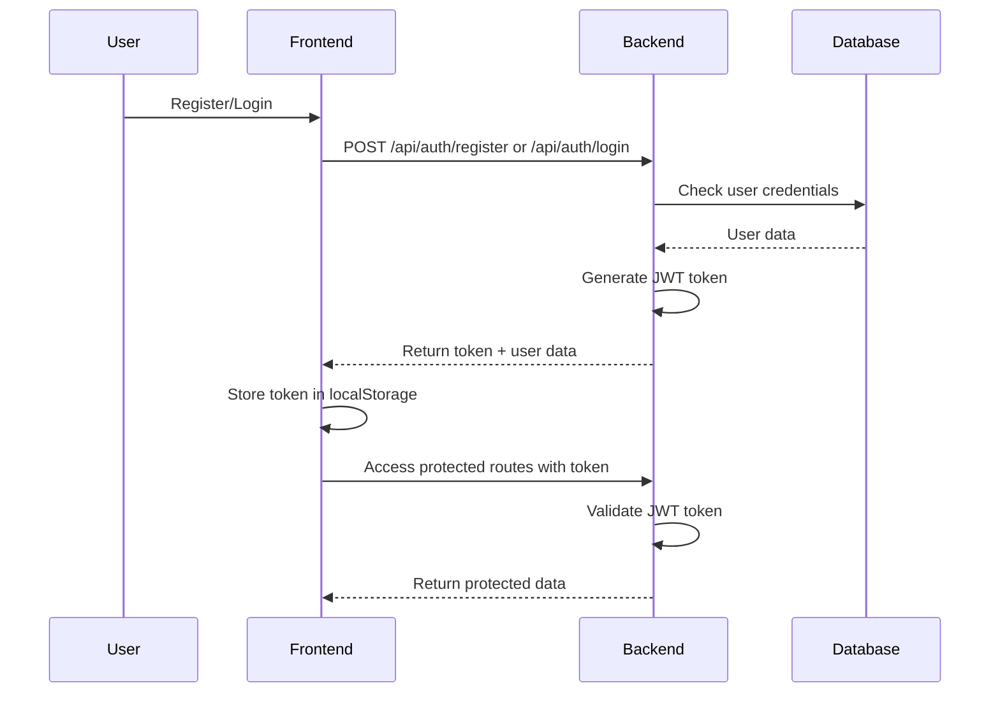

# 🚀 Go Chat Application

A modern, secure real-time chat application built with Go backend and vanilla JavaScript frontend, featuring complete user authentication, real-time messaging, and beautiful UI design.

## ✨ Features

### 🔐 Authentication System (✅ Complete)
- **User Registration** with validation and security
- **User Login** with JWT token authentication
- **User Logout** with proper session cleanup
- **Password Security** with bcrypt hashing
- **Rate Limiting** to prevent brute force attacks
- **Auto-login** with token persistence
- **Real-time form validation** with visual feedback

### 💬 Chat System
- **Real-time messaging** with WebSocket connections
- **Multiple chat rooms** support
- **Message history** with MongoDB storage
- **User presence** indicators
- **Cross-platform compatibility**

### 🎨 Modern UI/UX
- **Responsive design** for all devices
- **Beautiful gradient backgrounds** and animations
- **Interactive forms** with loading states
- **Real-time validation** feedback
- **Professional color schemes** and typography

## 🛠️ Technology Stack

### Backend
- **Language**: Go 1.19+
- **Framework**: Gin Web Framework
- **Database**: MongoDB
- **Authentication**: JWT (JSON Web Tokens)
- **Security**: bcrypt password hashing
- **WebSocket**: Gorilla WebSocket
- **CORS**: gin-contrib/cors

### Frontend
- **Language**: Pure JavaScript (ES6+)
- **Styling**: Modern CSS3 with Flexbox
- **HTTP Client**: Fetch API
- **Storage**: localStorage for token persistence
- **UI**: Responsive design with animations

## 📁 Project Structure

```
Go_chat/
├── docs/                           # 📚 Documentation
│   ├── README.md                   # Main documentation
│   ├── AUTHENTICATION.md           # Authentication system docs
│   ├── API.md                      # API documentation
│   ├── DEPLOYMENT.md               # Deployment guide
│   └── FEATURE_ONE_COMPLETE.md     # Feature completion report
├── backend/                        # 🔧 Go Backend
│   ├── auth/                       # Authentication module
│   │   ├── handlers.go             # Auth route handlers
│   │   ├── middleware.go           # JWT middleware
│   │   ├── auth.go                 # Password & validation utils
│   │   └── ratelimit.go            # Rate limiting system
│   ├── chat/                       # Chat module
│   │   └── chat.go                 # WebSocket & chat logic
│   ├── config/                     # Configuration
│   │   └── config.go               # Environment configuration
│   ├── db/                         # Database
│   │   └── database.go             # MongoDB connection
│   ├── models/                     # Data models
│   │   └── models.go               # User, Message, Room models
│   ├── utils/                      # Utilities
│   │   └── utils.go                # Helper functions
│   ├── main.go                     # Application entry point
│   ├── go.mod                      # Go dependencies
│   └── go.sum                      # Go checksums
├── frontend/                       # 🎨 Frontend
│   └── public/                     # Static files
│       ├── index-auth.html         # Full chat app with auth
│       ├── auth-demo.html          # Authentication demo
│       ├── api-tester.html         # API testing interface
│       └── launcher.html           # Frontend launcher
├── docker-compose.example.yml      # Docker setup example
├── Dockerfile                      # Docker configuration
├── setup.ps1                       # Setup script
├── LICENSE                         # MIT License
└── README.md                       # Project overview
```

## 🚀 Quick Start

### Prerequisites
- **Go 1.19+** installed
- **MongoDB** running (local or cloud)
- **Modern web browser**
- **Git** for version control

### 1. Clone Repository
```bash
git clone https://github.com/nazmusSakibRaiyan/Go_chat.git
cd Go_chat
```

### 2. Backend Setup
```bash
cd backend

# Install dependencies
go mod tidy

# Set environment variables (Windows)
$env:MONGO_URI="mongodb://localhost:27017"
$env:MONGO_DB_NAME="go_chat"
$env:JWT_SECRET="your-super-secret-jwt-key"
$env:PORT="8080"

# Run the server
go run main.go
```

### 3. Frontend Setup
```bash
cd frontend/public

# Start HTTP server (choose one)
python -m http.server 8000
# OR
npx serve -p 8000
# OR
php -S localhost:8000
```

### 4. Access Application
- **Frontend Launcher**: http://localhost:8000/launcher.html
- **Full Chat App**: http://localhost:8000/index-auth.html
- **API Tester**: http://localhost:8000/api-tester.html
- **Backend API**: http://localhost:8080/api

## 🔐 Authentication Flow



## 🎯 API Endpoints

### Authentication
- `POST /api/auth/register` - Register new user
- `POST /api/auth/login` - User login
- `POST /api/auth/logout` - User logout
- `GET /api/me` - Get current user (protected)

### Chat
- `GET /api/rooms` - Get chat rooms
- `POST /api/rooms` - Create chat room
- `GET /api/rooms/:id/messages` - Get room messages
- `GET /api/ws` - WebSocket connection

### System
- `GET /health` - Health check

## 🔧 Environment Configuration

Create a `.env` file or set environment variables:

```env
MONGO_URI=mongodb://localhost:27017
MONGO_DB_NAME=go_chat
JWT_SECRET=your-super-secret-jwt-key-here
PORT=8080
```

## 🧪 Testing

### Manual Testing
1. **Registration**: Create new accounts with different credentials
2. **Login**: Sign in with valid credentials
3. **Authentication**: Test token persistence and validation
4. **Chat**: Send messages in different rooms
5. **Security**: Test rate limiting and validation

### API Testing
Use the built-in API tester at `http://localhost:8000/api-tester.html`

## 🔒 Security Features

- **Password Hashing**: bcrypt with cost 14
- **JWT Authentication**: 24-hour token expiration
- **Rate Limiting**: 10 attempts per 5 minutes (development)
- **Input Validation**: Comprehensive server-side validation
- **CORS Protection**: Configured for secure cross-origin requests
- **SQL Injection Prevention**: MongoDB with proper query handling

## 📱 Responsive Design

The application is fully responsive and works on:
- 📱 **Mobile devices** (320px+)
- 📟 **Tablets** (768px+)
- 💻 **Desktops** (1024px+)
- 🖥️ **Large screens** (1440px+)

## 🎨 UI Features

- **Modern Design**: Clean, professional interface
- **Smooth Animations**: CSS transitions and transforms
- **Loading States**: Visual feedback for all actions
- **Error Handling**: User-friendly error messages
- **Form Validation**: Real-time validation with visual cues
- **Password Strength**: Visual strength indicator
- **Auto-focus**: Improved keyboard navigation

## 📚 Documentation

For detailed documentation, see the `/docs` folder:

- **[Authentication System](docs/AUTHENTICATION.md)** - Complete auth documentation
- **[API Reference](docs/API.md)** - Detailed API documentation
- **[Deployment Guide](docs/DEPLOYMENT.md)** - Production deployment
- **[Feature Report](docs/FEATURE_ONE_COMPLETE.md)** - Development progress

## 🐛 Troubleshooting

### Common Issues

**CORS Errors**
```bash
# Make sure frontend is served via HTTP server, not file://
python -m http.server 8000
```

**MongoDB Connection**
```bash
# Check MongoDB is running
mongosh
# OR start MongoDB service
net start MongoDB
```

**Port Already in Use**
```bash
# Kill process on port 8080
netstat -ano | findstr :8080
taskkill /f /pid <PID>
```

### Development Tips

1. **Rate Limiting**: Currently disabled for development
2. **CORS**: Set to allow all origins in development
3. **Logging**: Check console for detailed error messages
4. **Token Storage**: Tokens persist in localStorage

## 🤝 Contributing

1. Fork the repository
2. Create feature branch (`git checkout -b feature/amazing-feature`)
3. Commit changes (`git commit -m 'Add amazing feature'`)
4. Push to branch (`git push origin feature/amazing-feature`)
5. Open Pull Request

### Development Guidelines

- Follow Go best practices and conventions
- Write clean, documented code
- Test thoroughly before submitting
- Update documentation for new features
- Use meaningful commit messages

## 📄 License

This project is licensed under the MIT License - see the [LICENSE](LICENSE) file for details.

## 🙏 Acknowledgments

- **Gin Framework** - Fast HTTP web framework
- **MongoDB** - Document database
- **JWT-Go** - JWT implementation
- **Gorilla WebSocket** - WebSocket implementation
- **bcrypt** - Password hashing library

## 📞 Support

If you encounter any issues:

1. Check the [troubleshooting section](#-troubleshooting)
2. Review the [documentation](docs/)
3. Check existing [issues](https://github.com/nazmusSakibRaiyan/Go_chat/issues)
4. Create a [new issue](https://github.com/nazmusSakibRaiyan/Go_chat/issues/new)

---

**Built with ❤️ using Go and modern web technologies**

**Status**: ✅ Feature One (Authentication) Complete - Ready for Production
